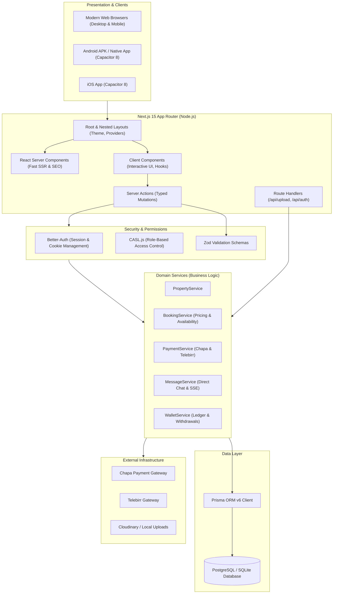
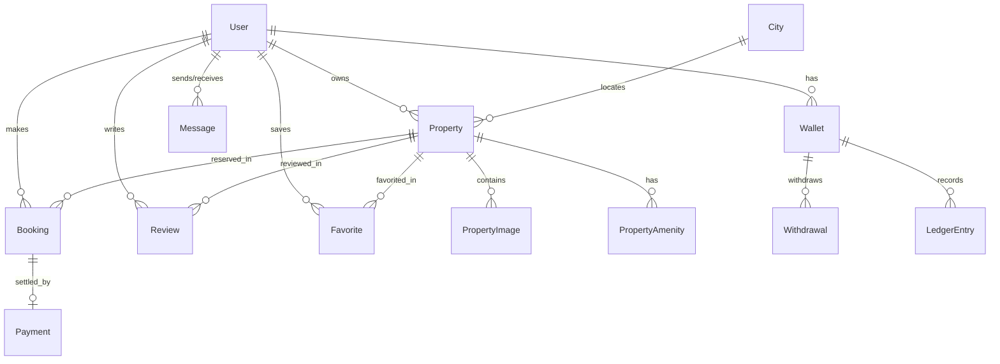

# EthioHome — System Architecture & Feature Documentation

This document provides a comprehensive technical overview of the **EthioHome** (Habesha Home) platform, covering system architecture, technology stack, directory structure, data flows, and mobile integration.

---

## 1. System Overview

**EthioHome** is a full-stack real-estate and vacation rental marketplace tailored for the Ethiopian market. It unifies a responsive Next.js 15 web application with a cross-platform Capacitor 8 mobile app for Android and iOS.



---

## 2. Technology Stack

### Frontend & UI
| Technology | Version | Purpose |
|---|---|---|
| **Next.js** | 15.2.0 | Full-stack framework (App Router, Server Components, Server Actions) |
| **React** | 19.0.0 | Core UI library |
| **Tailwind CSS** | 4.0 | Utility-first styling with custom EthioHome design tokens |
| **Framer Motion** | 12.4.7 | Smooth page transitions, modals, and bottom sheet drawers |
| **Lucide React** | 0.475.0 | Vector iconography |
| **next-themes** | 0.4.6 | Dark and light theme synchronization |
| **Sonner** | 2.0.1 | Toast notifications |
| **Recharts** | 2.15.1 | Financial charts and booking analytics |
| **React Hook Form** | 7.54.2 | High-performance client form validation |

### Backend & Persistence
| Technology | Version | Purpose |
|---|---|---|
| **Prisma ORM** | 6.4.0 / 6.19.3 | Type-safe database queries and migrations |
| **PostgreSQL / SQLite** | Latest | Relational database storage |
| **Better-Auth** | 1.1.20 | Authentication, credential hashing, and session management |
| **CASL** | 6.7.2 | Isomorphic permissions and Role-Based Access Control (RBAC) |
| **Zod** | 3.25.76 | Runtime type validation for forms and Server Actions |

### Mobile & Native Layer
| Technology | Version | Purpose |
|---|---|---|
| **Capacitor CLI & Core** | 8.5.2 | Web-to-native cross-platform bridge |
| **@capacitor/android** | 8.5.2 | Android platform container |
| **@capacitor/status-bar** | 8.0.3 | Native Android status bar theme synchronization |
| **@capacitor/haptics** | 8.0.2 | Native tactile vibration feedback |
| **@capacitor/network** | 8.0.1 | Network state monitoring and offline banners |
| **@capacitor/app** | 8.1.1 | Hardware back-button routing & app lifecycle |
| **@capacitor/share** | 8.0.2 | Native OS share sheet integration |

---

## 3. Architecture & Design Patterns

### 1. Three-Tier Layered Architecture
1. **Presentation Layer (`src/app/`, `src/components/`):**
   - Server Components render static and dynamic markup on the server for rapid First Contentful Paint (FCP) and SEO.
   - Client Components handle user input, modals, and client state.
   - `CapacitorProvider` decorates the tree with mobile device capabilities.
2. **Action / Controller Layer (`src/server/actions/`):**
   - Next.js Server Actions serve as RPC-style entry points.
   - Every action enforces:
     - Authentication (`requireAuth()`)
     - Input validation (`schema.parse()`)
     - Error handling with uniform responses (`createSuccessResponse` / `createErrorResponse`)
     - Cache invalidation (`revalidatePath()`)
3. **Domain Service Layer (`src/server/services/`):**
   - Pure, decoupled business logic (`PropertyService`, `BookingService`, `WalletService`, `PaymentService`, `MessageService`).
   - Handles transactions, mathematical calculations, and Prisma queries.

### 2. Isomorphic RBAC (Role-Based Access Control)
Roles: `GUEST`, `OWNER`, `ADMIN`
- Permissions are declared centrally in `src/lib/auth/permissions.ts` using CASL.
- Enforced at both layout level (`requireRole("ADMIN")`) and individual action level.

### 3. Concurrency-Safe Booking & Deterministic Pricing
- **Server Pricing Engine:** Nightly rates, weekly/monthly discounts, cleaning fees, and service fees are recomputed on the server to prevent client-side price tampering.
- **Double-Booking Prevention:** Date overlap checks are validated inside database transactions before confirming any reservation.

---

## 4. Directory Structure

```
habesha_home_web/
├── .github/
│   └── workflows/
│       └── build-apk.yml          # Automated Android APK CI/CD pipeline
├── android/                       # Native Android project generated by Capacitor
│   └── app/src/main/              # Manifest, Java source, assets, splash screens
├── prisma/
│   ├── schema.prisma              # Database models & relationships
│   └── seed.ts                    # Demo properties, Ethiopian cities & hosts
├── public/                        # Static assets (logos, icons, uploaded images)
├── src/
│   ├── app/                       # Next.js App Router
│   │   ├── (auth)/                # Login & Registration pages
│   │   ├── account/               # User account (Bookings, Favorites, Profile)
│   │   ├── admin/                 # Admin Dashboard (Listings, Users, Payouts)
│   │   ├── api/                   # API Route Handlers (Uploads, Auth, Webhooks)
│   │   ├── owner/                 # Host Dashboard (Listings Wizard, Bookings, Wallet)
│   │   ├── payment/               # Payment Success / Failure callback pages
│   │   ├── property/[id]/         # Property details & Booking confirmation flow
│   │   ├── search/                # Filterable search catalog
│   │   ├── globals.css            # Tailwind CSS styling tokens
│   │   └── layout.tsx             # Root layout with providers & bottom navigation
│   ├── components/                # Modular React Components
│   │   ├── booking/               # Payment method selector, date picker, booking card
│   │   ├── dashboard/             # Host & Admin analytics grids, charts
│   │   ├── navigation/            # Header, Footer, MobileBottomNav
│   │   ├── property/              # PropertyCard, Gallery, ActionButtons, Reviews
│   │   ├── shared/                # CapacitorProvider, ThemeProvider, RealtimeProvider
│   │   └── ui/                    # Primitive components (Button, Input, Card, Modal)
│   ├── lib/                       # Shared Utilities
│   │   ├── auth/                  # Better-Auth setup, session helpers, CASL rules
│   │   ├── db.ts                  # Prisma client singleton
│   │   ├── errors/                # Standardized ActionResponse helpers
│   │   └── validations/           # Zod schemas for all forms & actions
│   └── server/                    # Server-Only Logic
│       ├── actions/               # Server Actions (property, booking, payment, message)
│       └── services/              # Business domain services
├── capacitor.config.ts            # Capacitor mobile bridge configuration
└── package.json                   # Scripts and project dependencies
```

---

## 5. Detailed Feature Matrix

### Renter / Guest Features
- **Smart Search & Filters:** Filter properties by destination city (Addis Ababa, Bishoftu, Hawassa, etc.), price range, property type (Villa, Apartment, Guesthouse), and bedrooms.
- **Ethiopian Living Assurances:** Verified indicators for:
  - ⚡ 24/7 Standby Generator
  - 💧 Continuous Water Reservoir Tank
  - 🌐 High-Speed Fiber Internet
  - 🛡️ 24/7 Gated Security
- **Interactive Booking Widget:** Dynamic date selection, guest counter, automatic fee calculation, and instant booking submission.
- **Ethiopian Local Payments:** Integrated support for:
  - **Chapa** (Local & International Debit/Credit Cards, CBE Birr, Awash, Dashen)
  - **Telebirr** (Direct mobile money payments)
- **Direct Host Chat:** Real-time host chat modal with instant messaging.
- **Favorites / Wishlist:** Instant bookmarking saved to the user profile.
- **Verified Reviews:** Rating breakdown across Cleanliness, Accuracy, Communication, and Value.

### Host / Property Owner Features
- **Host Hub Dashboard:** Real-time stats on total listings, monthly revenue, pending reservations, and occupancy rates.
- **Multi-Step Listing Wizard:** Form for uploading photos, setting location coordinates, selecting amenities, and configuring nightly/monthly rates.
- **Reservation Control:** Review, approve, or cancel incoming bookings.
- **Host Financial Wallet:** Auditable balance sheet, earnings breakdown, and withdrawal requests to Ethiopian commercial banks or Telebirr accounts.

### Platform Administrator Features
- **Executive Analytics:** Overview of Gross Transaction Volume (GMV), 5% platform commission fees, active listings, and registered users.
- **Listing Moderation:** Review newly submitted properties with one-click approval or rejection.
- **Withdrawal Audits:** Review and disburse host payout requests with automatic ledger balance deduction.
- **User Role Management:** Promote users to `OWNER` or `ADMIN`, or suspend fraudulent accounts.

### Mobile-Native App Features
- **Theme-Synced Status Bar:** Dynamic status bar styling that matches dark or light mode.
- **Hardware Back-Button Navigation:** Pressing the Android back button steps through browser history naturally or prompts on the home screen.
- **Tactile Haptic Feedback:** Physical vibration feedback on tab changes, card clicks, and button presses.
- **Offline Network Detection:** Detects airplane mode or network drops and displays an interactive reconnect banner.
- **Native Share Integration:** Uses the Android/iOS native share dialog to share property links.

---

## 6. Database Schema Overview



### Core Entities:
- **`User`**: Account details, roles (`GUEST`, `OWNER`, `ADMIN`), and authentication tokens.
- **`Property`**: Title, slug, description, property type, price per night/month, coordinates, verification status, and ratings.
- **`City`**: Major Ethiopian cities (Addis Ababa, Bishoftu, Hawassa, Bahir Dar, Gondar).
- **`Booking`**: Check-in, check-out, guest count, subtotal, VAT (15%), service fee (5%), and status (`PENDING`, `CONFIRMED`, `CANCELLED`, `COMPLETED`).
- **`Payment`**: Transaction reference, provider (`CHAPA`, `TELEBIRR`), currency (`ETB`), and verification status.
- **`Wallet` & `LedgerEntry`**: Immutable host balances tracking every credit and debit transaction.
- **`Message`**: Conversations between guests and hosts with timestamps.

---

## 7. Developer & Operations Guide

### Local Development Setup
```bash
# 1. Install dependencies
npm install

# 2. Configure environment variables (.env)
DATABASE_URL="file:./dev.db" # or PostgreSQL connection string
BETTER_AUTH_SECRET="your-secret-key"
NEXT_PUBLIC_APP_URL="http://localhost:3000"

# 3. Initialize database
npx prisma generate
npx prisma db push
npm run db:seed

# 4. Start Next.js development server (binds to 0.0.0.0 for LAN/mobile access)
npm run dev
```

### Building the Mobile APK

#### Option A: Automated via GitHub Actions CI (Recommended)
1. Commit and push your changes to `main`:
   ```bash
   git push origin main
   ```
2. The GitHub Actions workflow (`.github/workflows/build-apk.yml`) automatically builds the debug APK.
3. Download the built APK with the GitHub CLI:
   ```bash
   gh run download <RUN_ID> --dir ./apk-output
   ```

#### Option B: Local Build with Android Studio
```bash
# 1. Sync web assets and Capacitor configuration
npx cap sync android

# 2. Open project in Android Studio
npm run cap:open

# 3. In Android Studio: Build > Build Bundle(s) / APK(s) > Build APK(s)
```
The output APK is generated at:
`android/app/build/outputs/apk/debug/app-debug.apk`
